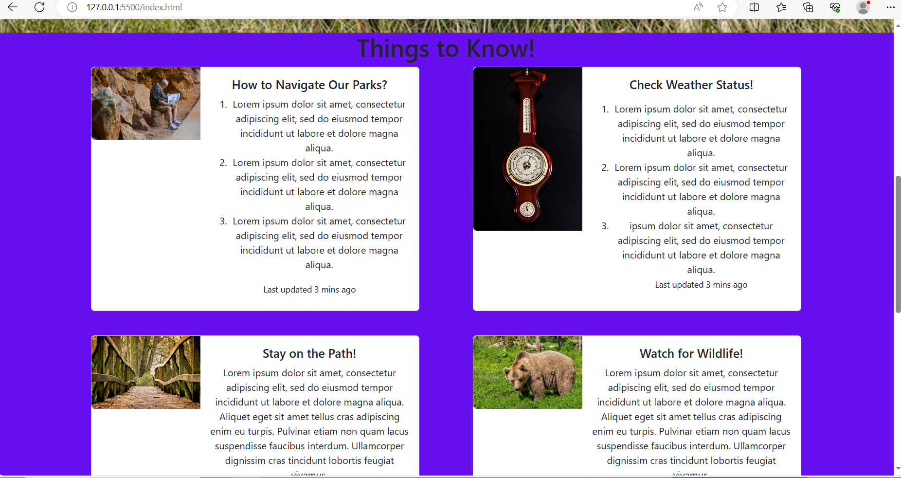
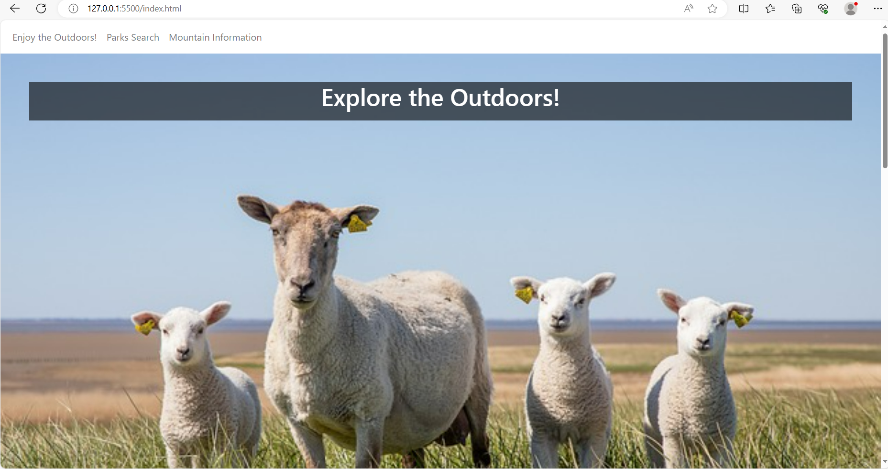
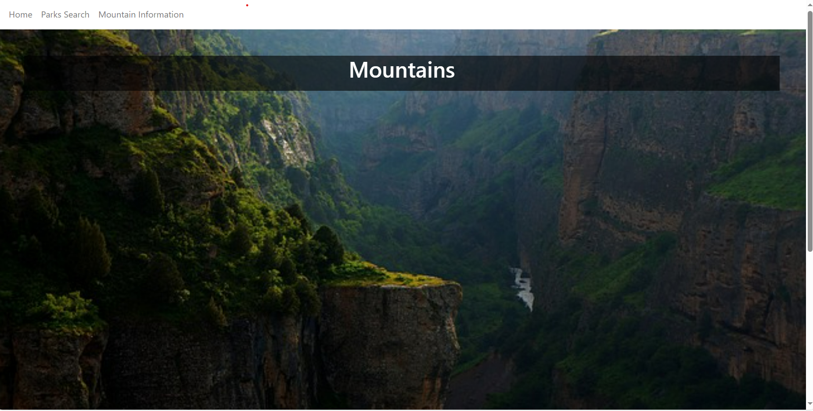
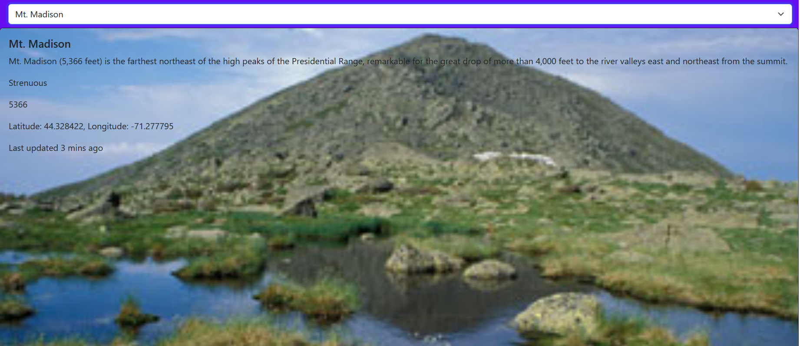
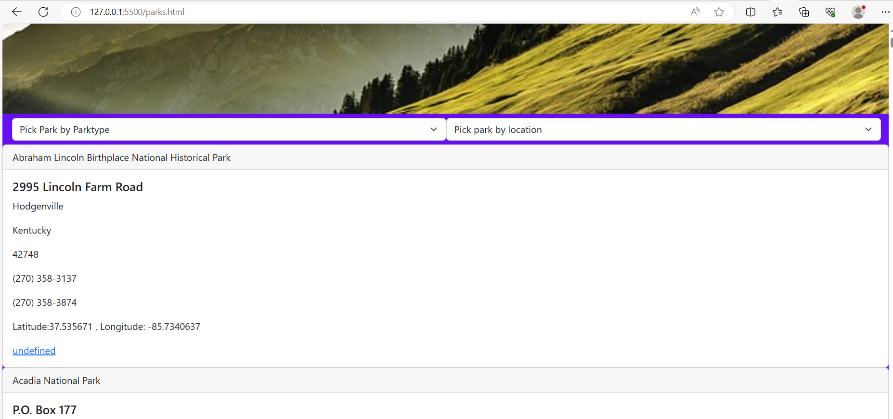
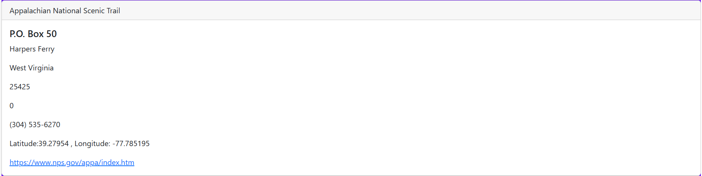

# enjoy-the-outdoors
Enjoy the Outdoors 

A National Parks webpage that was used to showcase my knowlegde of Javascript. I implemented the data provided to me inside of the project repository using innerHTML, and to design my project i used HTML and CSS to make it look more stylized. 

 The best part to me was styling my cards to make my project look nicer! It was a bit frustating but after getting help from my classmates and instructor i am really proud in the way it looks! 

![index page with jumbotron header and info cards]  

![ mountains jumbotron and mountain card with image stretch]  

![ all parks,by parktype and by location page] 
![park visit stretch!] 
